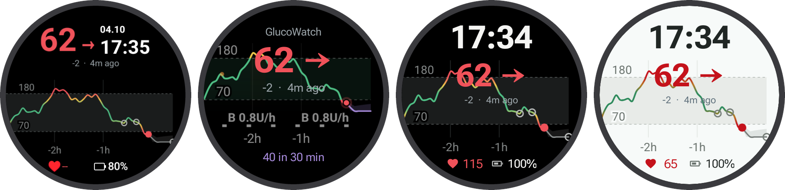
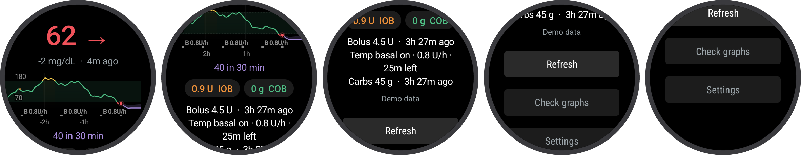
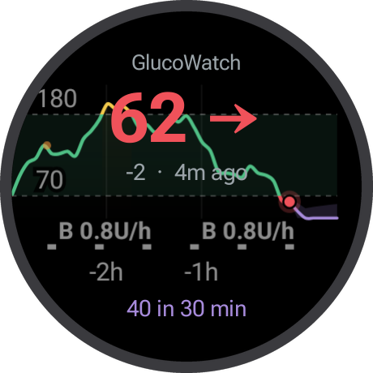
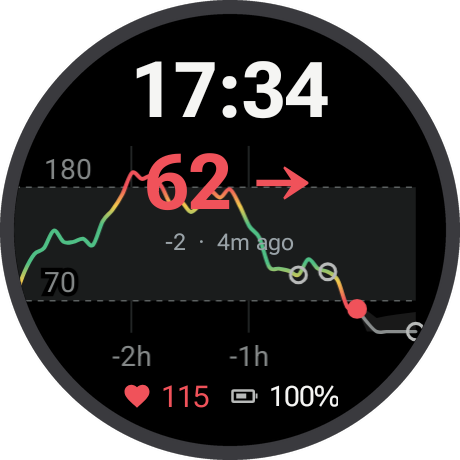
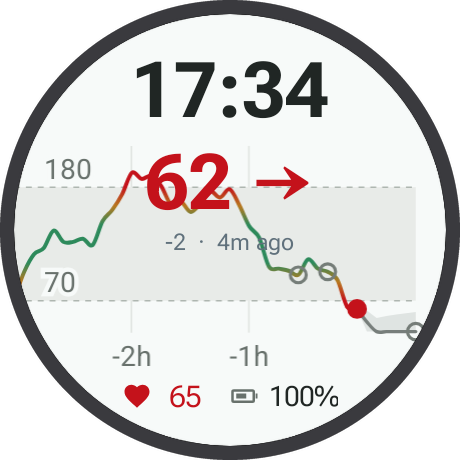
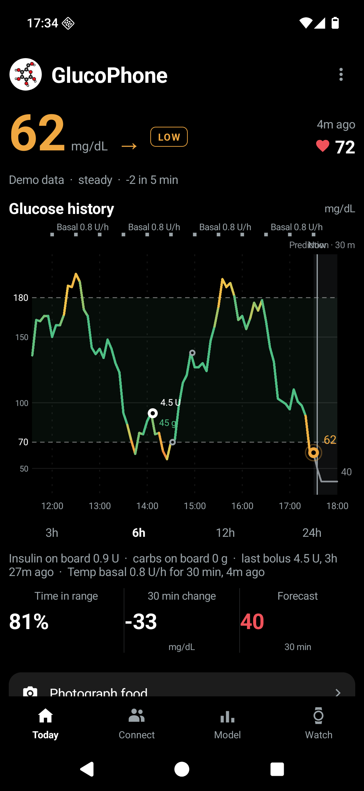
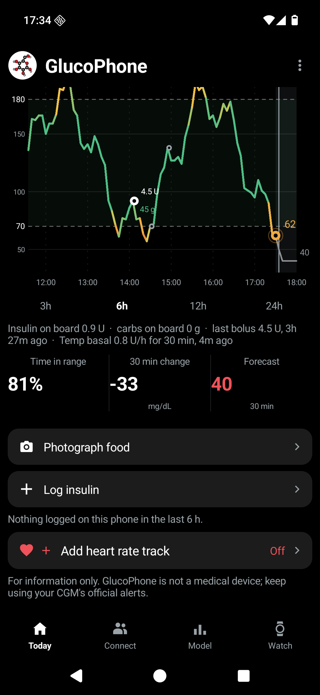

# GlucoWatch & GlucoPhone

Your glucose on your wrist and your Android phone: current readings, trends, history,
insulin and carbs, and optional forecasts. **GlucoWatch** is a Wear OS app with a watch face
and three tiles. **GlucoPhone** is a phone dashboard you can use on its own or connect to your watch.

Use Dexcom Share or your own Nightscout, or try everything with built-in demo data before
connecting an account. The watch can fetch directly, so the phone app is optional.
There is no GlucoWatch server and no Google Play Services dependency.

[Install and try it](#install-and-test-from-your-phone) ·
[Connect your data](#connect-your-data) ·
[Pair your watch](#connect-your-phone-and-watch) ·
[Developer guide](#for-developers)

## On your watch



- **Glucose at a glance:** a large reading, trend arrow and reading age, with a chart from rim to rim.
- **A watch face and three tiles:** glucose only, glucose with time and heart rate, and a light theme.
  Tap the glucose value to open the app for more detail.
- **Complications for other faces:** glucose, chart, forecast, insulin/carbs on board,
  and the last bolus/carbs, where your data source supplies them.
- **Treatment context:** Nightscout or the phone's connected pump source can add boluses,
  carbs, basal events, and insulin/carbs on board.
- **Optional forecasts:** a glucose trend, your Nightscout loop's forecast, or a model running on the phone.
- **Freshness you can see:** old readings are marked **OLD DATA**. An optional notification
  tells you when readings are more than ten minutes old; Android can delay background refreshes and alerts.

<details>
<summary>See the watch app and individual tiles</summary>



<table>
  <tr>
    <th>Glucose</th>
    <th>Glucose, time and heart</th>
    <th>Glucose (light)</th>
  </tr>
  <tr>
    <td></td>
    <td></td>
    <td></td>
  </tr>
</table>

[Watch face screenshot](docs/images/screenshots/watch-face.png)

</details>

## On your phone

<table>
  <tr>
    <th>Glucose and history</th>
    <th>Meals, insulin and heart rate</th>
  </tr>
  <tr>
    <td></td>
    <td></td>
  </tr>
</table>

- **A glucose dashboard:** current value and trend, reading age, time in range, the
  30-minute change, and an optional forecast, in mmol/L or mg/dL.
- **Draggable history:** switch between 3, 6, 12 and 24 hours and drag back through up to
  two weeks of locally retained readings. Longer history builds up as the app collects data.
- **Meals and insulin:** photograph food, record carbs, and log bolus or basal doses on the chart.
  These personal logs and photos stay on the phone.
- **Pump and loop data:** combine your CGM with your own Nightscout or CareLink insulin data.
- **Heart rate:** an optional Health Connect track on Android 14 or later, when your phone
  has samples and you grant access.
- **Local prediction:** choose a built-in forecast or import a compatible ONNX model from
  a file or Hugging Face. Inference runs on the phone. See the [prediction guide](docs/prediction.md).
- **Easier watch setup:** relay readings and forecasts over Bluetooth, or copy your Dexcom
  or Nightscout login to the watch so you can avoid its keyboard.

All screenshots above use **synthetic demo data**, captured on Galaxy Watch6 Classic
43 mm and Galaxy S22-sized emulators. Demo heart rates and forecasts are illustrative.

> GlucoWatch and GlucoPhone are not medical devices. Do not use them for treatment decisions.
> Keep using your CGM's official app and alarms.

## Install and test from your phone

You need **Android 10 or later** for GlucoPhone. To use GlucoWatch, add a watch running
**Wear OS 4 or later**. You can try the phone app without owning a watch.

The [latest GitHub release](https://github.com/GlucoseDAO/glucowatch/releases/latest) has
three separate APKs (Android installer files):

| App | File in the release | Install on |
|---|---|---|
| GlucoPhone | `glucowatch-phone-<version>.apk` | Your Android phone |
| GlucoWatch | `glucowatch-<version>.apk` | Your Wear OS watch |
| GlucoWatch face | `glucowatch-watchface-<version>.apk` | Your Wear OS watch, alongside GlucoWatch |

### 1. Install GlucoPhone through Obtainium

[Obtainium](https://obtainium.imranr.dev/) installs Android apps from their release pages
and checks for updates. On your phone:

1. Install Obtainium from its [official releases](https://github.com/ImranR98/Obtainium/releases/latest).
   Most current phones use its `app-arm64-v8a-release.apk`; use `app-release.apk` if you
   need the universal APK. Android may ask you to allow your browser to **Install unknown apps**.
2. Open Obtainium → **Add App** and paste this repository URL:

   ```text
   https://github.com/GlucoseDAO/glucowatch
   ```

3. Open the additional options and set **Filter APKs by Regular Expression** to:

   ```text
   ^glucowatch-phone-.*\.apk$
   ```

4. Add the app, then tap **Install**. If Android asks, allow Obtainium to **Install unknown apps**
   and finish the installation. If you see an APK chooser, select `glucowatch-phone-<version>.apk`.
5. Open **GlucoPhone**. The release starts with **Demo data**, so you can explore **Today**,
   scroll the dashboard, drag the chart and try the logging controls without an account or network.
   Use **Connect** when you are ready for your own data.

The APK filter selects the phone app from a release that also contains two watch packages.
See Obtainium's [APK filter documentation](https://wiki.obtainium.imranr.dev/sources/).
Keep this entry in Obtainium to receive future phone updates.

### 2. Install the watch app and face from your phone

**Obtainium on your phone installs apps on the phone. It does not install them on your watch.**
Use **Wear Installer 2** to send the two watch APKs to the watch. You can do this without a computer.

1. In your phone's browser, open the
   [latest release](https://github.com/GlucoseDAO/glucowatch/releases/latest), expand **Assets**,
   and download `glucowatch-<version>.apk` and `glucowatch-watchface-<version>.apk` to **Downloads**.
   Choose the same version as GlucoPhone.
2. Install [Wear Installer 2](https://play.google.com/store/apps/details?id=org.freepoc.wearinstaller2)
   on your phone. Connect the phone and watch to the same Wi-Fi network.
3. On a Galaxy Watch, open **Settings → About watch → Software information** and tap
   **Software version** repeatedly until Developer options are enabled. On other watches,
   tap **Build number** under **Settings → System → About → Versions**.
4. In the watch's **Developer options**, turn on **ADB debugging** and **Wireless debugging**.
   Open Wireless debugging and note the watch's IP address.
5. In Wear Installer 2, enter the IP address → **Done**, then menu → **Pair with watch** → **Enable**.
   On the watch, tap **Pair new device**. Enter its six-digit code, a space, and its pairing port
   in Wear Installer 2 → **Done**.
6. Return to the watch's main **Wireless debugging** screen. Enter its **connection port**
   in Wear Installer 2's port field. This is different from the pairing port in the previous step.
7. In Wear Installer 2, choose **Custom APK**, select `glucowatch-<version>.apk` from Downloads,
   and tap **Install**. Repeat for `glucowatch-watchface-<version>.apk`.
8. Open **GlucoWatch** on the watch to see demo data. Turn off **Wireless debugging** and
   **ADB debugging** when finished to save battery.

If pairing or installation fails, follow the installer's
[Wear OS 4+ help](https://freepoc.org/wear-installer-2-help-page/).
This Wi-Fi pairing is for installation; the Bluetooth pairing inside GlucoPhone is a separate step below.

### 3. Add the face and tiles

Long-press the current watch face → **Add watch face** → **GlucoWatch face**.
If a complication is empty, long-press → **Customize** → tap the slot → choose a GlucoWatch
provider such as **Glucose** or **Glucose chart**. The face needs the GlucoWatch app on the same watch.

Swipe through the watch's tiles → **Add tiles** and choose **Glucose**, **Glucose, time and heart**,
or **Glucose (light)**. For heart rate, grant access when the face asks, and tap
**Allow heart rate** in GlucoWatch → Settings for the tiles.

### Updating later

Obtainium checks for GlucoPhone updates; open its entry to install an available update.
For the watch, download the newer app and face APKs from the same release and repeat
**Custom APK → Install** in Wear Installer 2. This updates the installed copies.
Update all three packages together so the phone and watch use compatible versions.
The watch's Wi-Fi address and connection port can change when you enable debugging again.

If you prefer a computer, use the [adb installation instructions](#install-the-watch-from-a-computer).
The phone app has not been submitted to F-Droid. Links to the watch and face submissions
are in the [release notes for developers](#build-and-test) below.

## Connect your data

On GlucoPhone, open **Connect**. On GlucoWatch, open **Settings**. Choose a source,
set your display units and tap **Save & test**.

| Source | What you need | What it provides |
|---|---|---|
| Demo data | Nothing | Sample glucose, treatments and a forecast; works offline |
| Dexcom Share | Dexcom username, password and account region | Glucose and trend; enable Share in the official Dexcom app with at least one follower |
| Nightscout | Your site's URL and, for a private site, a read token | Glucose, uploaded treatments, insulin/carbs on board and loop forecasts when available |
| Dexcom G6 notifications (phone only) | Official G6 app on the same phone, Quick Glance on, notification access | New glucose readings collected locally; no Share login or glucose backfill |
| CareLink (MiniMed) | A care partner account and the account's country | Pump data where uploaded; can also supply glucose, depending on the device |

**Dexcom Share:** choose **Outside US (EU)**, **US**, or **Japan** for your account.
A wrong region can look like a failed login. Share does not supply insulin or carbs.

**Nightscout:** enter your site's address. Use API v1 unless you specifically need v3;
API v3 requires a token. For a private site, create a token with the `readable` role under
**Admin tools → Subjects**. The app reads your site; it does not write treatments back.
Loop data is displayed only while fresh. See [Nightscout support](docs/nightscout.md).

**G6 notifications:** on the phone's Connect tab, choose Dexcom and enable
**Use G6 notifications instead of Dexcom Share**. Turn on Quick Glance in G6, tap
**Allow notification access**, grant access in Android settings, return and tap **Save & test**.
New readings can take five minutes to arrive. History starts when collection begins;
notification timestamps may differ from sensor timestamps. For the watch, use **Phone app** as its source.

**Additional insulin sources:** use your own Nightscout or CareLink alongside your CGM to
show therapy data. Only combine sources belonging to the same person.
[CareLink setup](docs/carelink.md) explains browser sign-in and the pump data available.

You can also import an existing configuration with **Connect → Upload .env / YAML** or
**Import from URL**. See [configuration import](docs/configuration-import.md) and the
[YAML example](config.example.yaml). A filled configuration contains credentials; keep it private.

## Connect your phone and watch

First pair your watch with your phone through its usual Wear OS or Galaxy Wearable setup.
Then pair the two GlucoWatch apps:

1. On the phone, open **GlucoPhone → Watch → Pair a watch**.
2. On the watch, open **GlucoWatch → Settings → Pair with phone**.
   Allow **Nearby devices** on both devices and keep the pairing screens open.
3. Compare the six-digit codes and tap **Codes match** on both devices.
4. Choose how the watch gets its readings:

   | Mode | Watch setting | When to use it |
   |---|---|---|
   | The phone fetches and relays | Source **Phone app** → **Save & test** | Use the phone's CGM/pump data or G6 notifications; the watch needs Bluetooth range, but no internet or login |
   | The watch fetches directly | Source **Dexcom Share** or **Nightscout** → **Copy login from phone** → **Save & test** | Enter the login on the phone once, then let the watch use its own network connection |

With **Phone app** as the watch source, choose **Phone app model** under Forecast to
show the forecast computed by GlucoPhone. The model stays on the phone.

The Bluetooth relay is still being tested: **pairing, syncing and copying a login between a
real phone and watch have not yet been verified**. The standalone watch and phone apps can be
tried independently. See [phone link status and limits](docs/phone-link.md#what-is-verified).
If you report a test result, include device models, OS versions and app versions, and remove
credentials and personal health data from anything you post publicly.

## Privacy and troubleshooting

Credentials and caches stay in each app's private storage. Source requests go to the services
you select; there is no project server. The phone–watch exchange is encrypted after you confirm
pairing. Meal photos, manually logged meals/insulin and phone heart-rate data stay on the phone.
An imported model runs locally; selecting a Hugging Face model downloads its files without
uploading your glucose. See the [phone link guide](docs/phone-link.md).

- **No reading:** check the selected source, Dexcom Share/follower setup or Nightscout token,
  and the status returned by **Save & test**.
- **Old readings:** check your upstream CGM and internet connection. A successful connection
  does not make an old reading fresh. In phone relay mode, also check Bluetooth range.
- **Dexcom works on Wi-Fi but fails on mobile:** use watch Settings → **Connection check**.
  [Carrier blocking](docs/carrier-blocking.md) explains the errors and available routes.
  **Resolve over HTTPS** is off by default; use it only for a diagnosed DNS failure.
- **Phone sync stops:** check Nearby devices permission and the phone's battery restrictions.
  Some manufacturers stop background services; see [known limits](docs/phone-link.md#known-limits).
- **Empty face:** install both the watch app and face, open the app once, then check complication providers.

## For developers

For Android Studio, JDK 21, a virtual watch, debug defaults and desktop source checks,
see [Developing GlucoWatch](docs/development.md). Released APKs need none of that setup.
Project rules are in [AGENTS.md](AGENTS.md). The license is [Apache-2.0](LICENSE).

### Modules

| Module | Role |
|---|---|
| `core/` | JVM clients, source sync, models, predictors, demo data, encrypted phone link and desktop CLI |
| `app/` | Wear OS app, cached readings, settings, five complications and three tiles |
| `watchface/` | Watch Face Format XML; shows the app's complications |
| `phone/` | GlucoPhone dashboard, source setup, local model imports and Bluetooth relay |
| `onnx-inference/` | Shared adapter for the phone's local ONNX Runtime inference |

### Build and test

Requirements: Android SDK (`ANDROID_HOME` or `sdk.dir` in `local.properties`) and an installed
JDK 21 compiler. Gradle 9.1.0's wrapper runs on Java 17–25.

```bash
./gradlew :core:test
./gradlew :app:assembleDebug :watchface:assembleDebug :phone:assembleDebug
```

Debug APKs are in each module's `build/outputs/apk/debug/` directory. Debug builds can compile
private `.env` defaults into the APK; keep those APKs private. Release builds leave credential
fields empty. See the [debug setup guide](docs/development.md#debug-defaults-in-env).

Before a release tag, test and build inside each module, as F-Droid does:

```bash
./gradlew :core:test
(cd app && ../gradlew assembleRelease)
(cd watchface && ../gradlew assembleRelease)
(cd phone && ../gradlew assembleRelease)
```

Keep all three app version codes/names together. Signing, reproducibility, store requirements
and metadata are covered in [store publishing](docs/store-publishing.md).
F-Droid submissions: [watch app](https://gitlab.com/fdroid/fdroiddata/-/merge_requests/49882)
and [watch face](https://gitlab.com/fdroid/fdroiddata/-/merge_requests/49898).

### Install the watch from a computer

Enable watch ADB/Wireless debugging and use the pairing and connection ports described
[above](#2-install-the-watch-app-and-face-from-your-phone). Install
[Android platform-tools](https://developer.android.com/tools/releases/platform-tools), download
the app and face APKs from the same release, and replace the placeholders:

```bash
adb pair <watch-ip>:<pair-port>     # enter the six-digit pairing code
adb connect <watch-ip>:<connect-port>
adb -s <watch-ip>:<connect-port> install -r glucowatch-<version>.apk
adb -s <watch-ip>:<connect-port> install -r glucowatch-watchface-<version>.apk
```

Turn debugging off afterwards. For debug builds, substitute the local APK paths from the
[developer guide](docs/development.md#7-install-them-on-the-virtual-watch).

### Screenshots and implementation guides

```bash
uv run scripts/screenshots.py demo              # default 432 px round watch
uv run scripts/screenshots.py demo --watch all  # all three Galaxy watch sizes
uv run scripts/phone_screenshots.py demo         # 1080 × 2340 phone emulator
```

Generated captures stay in gitignored `data/output/screenshots/`. The reviewed demo images
used above are checked in under `docs/images/screenshots/`; their provenance and refresh commands
are in [the screenshot guide](docs/screenshots.md#readme-screenshots).
Never publish real-data captures. Store assets come only from demo captures using
`uv run scripts/store_images.py`; the icon comes from `uv run scripts/make_icon.py`.

Further details: [Nightscout APIs and freshness](docs/nightscout.md),
[Bluetooth pairing and encryption](docs/phone-link.md),
[network diagnostics](docs/carrier-blocking.md),
[local prediction](docs/prediction.md), and
[configuration import](docs/configuration-import.md).
